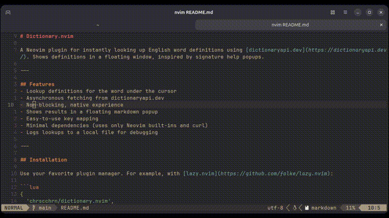

# Dictionary.nvim

> Instantly look up English word definitions in Neovim! Supercharge your workflow with floating popups, powered by [dictionaryapi.dev](https://dictionaryapi.dev/) and a sprinkle of Neovim magic.

---

## Demo

[](https://private-user-images.githubusercontent.com/64811235/459752428-66b335f8-674d-47c4-b970-df5b70112688.mp4?jwt=eyJhbGciOiJIUzI1NiIsInR5cCI6IkpXVCJ9.eyJpc3MiOiJnaXRodWIuY29tIiwiYXVkIjoicmF3LmdpdGh1YnVzZXJjb250ZW50LmNvbSIsImtleSI6ImtleTUiLCJleHAiOjE3NTA5OTc5NDUsIm5iZiI6MTc1MDk5NzY0NSwicGF0aCI6Ii82NDgxMTIzNS80NTk3NTI0MjgtNjZiMzM1ZjgtNjc0ZC00N2M0LWI5NzAtZGY1YjcwMTEyNjg4Lm1wND9YLUFtei1BbGdvcml0aG09QVdTNC1ITUFDLVNIQTI1NiZYLUFtei1DcmVkZW50aWFsPUFLSUFWQ09EWUxTQTUzUFFLNFpBJTJGMjAyNTA2MjclMkZ1cy1lYXN0LTElMkZzMyUyRmF3czRfcmVxdWVzdCZYLUFtei1EYXRlPTIwMjUwNjI3VDA0MTQwNVomWC1BbXotRXhwaXJlcz0zMDAmWC1BbXotU2lnbmF0dXJlPTU2NmU3OTYzYTRhYmFiYzRkMWNkY2M0NThhOGY2MGNjNDVhZTMwOGJhZDBlYTU5YzAyNmIxOWJhZDljNGFlMDMmWC1BbXotU2lnbmVkSGVhZGVycz1ob3N0In0.ytv6XnlMd-HcpByASmqUi_C1xD3whYUOdCLWD3pgVuY)

---

## Features

- **Quick lookup**: Get definitions for the word under your cursor
- **Async & non-blocking**: Never lose your editing flow
- **Beautiful floating popups**: Definitions appear in a stylish markdown window
- **One-tap key mapping**: Just hit `<leader>d` (or your favorite key!)
- **Minimal dependencies**: Uses only Neovim built-ins and `curl`
- **Debug logging**: All lookups logged for easy troubleshooting

---

## Installation

Add with your favorite plugin manager:

<details>
<summary>lazy.nvim</summary>

```lua
{
  'chrscchrn/dictionary.nvim',
  config = function()
    require('dictionary').setup()
  end,
}
```
</details>

<details>
<summary>packer.nvim</summary>

```lua
use {
  'chrscchrn/dictionary.nvim',
  config = function()
    require('dictionary').setup()
  end,
}
```
</details>

---

## Usage

1. Place your cursor over any English word in normal mode.
2. Press `<leader>d` (default) to summon the definition popup.
3. If there's no word, you'll get a friendly warning.

---

## Configuration

Zero-config out of the box! Want a custom keymap? Just override it after setup:

```lua
require('dictionary').setup()
vim.keymap.set('n', '<leader>w', require('dictionary').lookup_word, { desc = 'Dictionary Lookup' })
```

---

## Requirements
- Neovim 0.8+
- `curl` in your system path

---

## Credits
- [dictionaryapi.dev](https://dictionaryapi.dev/) for the free dictionary API
